# Diagram index

Current context is documentary; cloud is proposal; all other diagrams describe the synthetic implementation or explicitly noted logical stages. ERDs omit some columns for readability; migrations are authoritative.

## 01-current-context

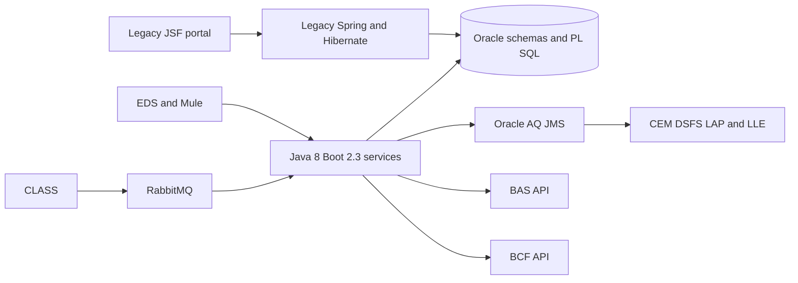
```mermaid
flowchart LR
 Portal[Legacy JSF portal] --> Legacy[Legacy Spring and Hibernate]
 EDS[EDS and Mule] --> Boot[Java 8 Boot 2.3 services]
 CLASS[CLASS] --> Rabbit[RabbitMQ]
 Rabbit --> Boot
 Legacy --> Oracle[(Oracle schemas and PL SQL)]
 Boot --> Oracle
 Boot --> AQ[Oracle AQ JMS]
 AQ --> Downstream[CEM DSFS LAP and LLE]
 Boot --> BAS[BAS API]
 Boot --> BCF[BCF API]

```

## 02-target-trust-boundaries

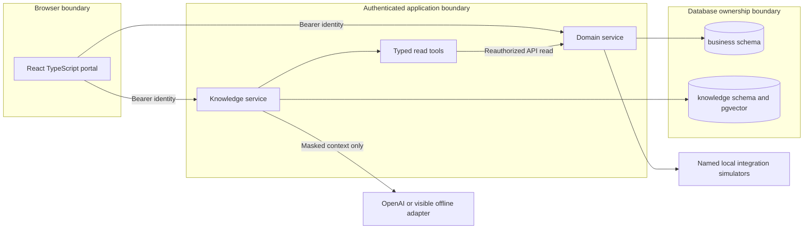
```mermaid
flowchart LR
 subgraph Browser[Browser boundary]
  UI[React TypeScript portal]
 end
 subgraph Trusted[Authenticated application boundary]
  B[Domain service]
  K[Knowledge service]
  R[Typed read tools]
 end
 subgraph DB[Database ownership boundary]
  Business[(business schema)]
  Knowledge[(knowledge schema and pgvector)]
 end
 UI -->|Bearer identity| B
 UI -->|Bearer identity| K
 B --> Business
 K --> Knowledge
 K --> R
 R -->|Reauthorized API read| B
 K -->|Masked context only| Model[OpenAI or visible offline adapter]
 B --> Sim[Named local integration simulators]

```

## 03-business-erd

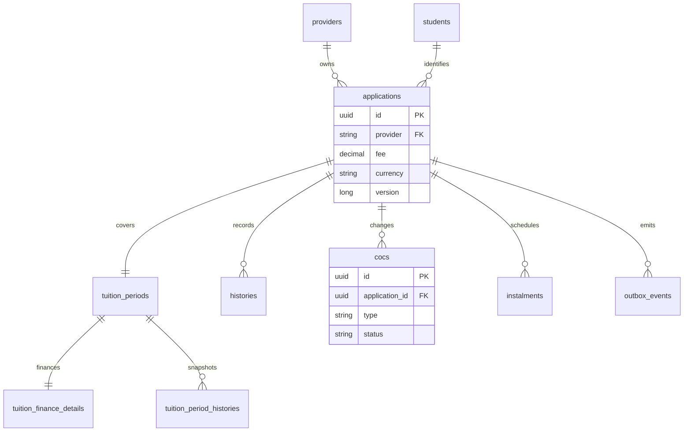
```mermaid
erDiagram
 providers ||--o{ applications : owns
 students ||--o{ applications : identifies
 applications ||--|| tuition_periods : covers
 tuition_periods ||--|| tuition_finance_details : finances
 tuition_periods ||--o{ tuition_period_histories : snapshots
 applications ||--o{ histories : records
 applications ||--o{ cocs : changes
 applications ||--o{ instalments : schedules
 applications ||--o{ outbox_events : emits
 applications {
  uuid id PK
  string provider FK
  decimal fee
  string currency
  long version
 }
 cocs {
  uuid id PK
  uuid application_id FK
  string type
  string status
 }

```

## 04-catalogue-erd

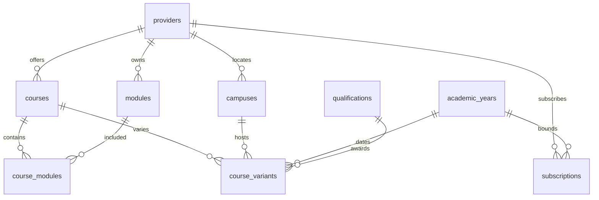
```mermaid
erDiagram
 providers ||--o{ courses : offers
 providers ||--o{ campuses : locates
 providers ||--o{ modules : owns
 courses ||--o{ course_modules : contains
 modules ||--o{ course_modules : included
 courses ||--o{ course_variants : varies
 campuses ||--o{ course_variants : hosts
 academic_years ||--o{ course_variants : dates
 qualifications ||--o{ course_variants : awards
 providers ||--o{ subscriptions : subscribes
 academic_years ||--o{ subscriptions : bounds

```

## 05-knowledge-erd

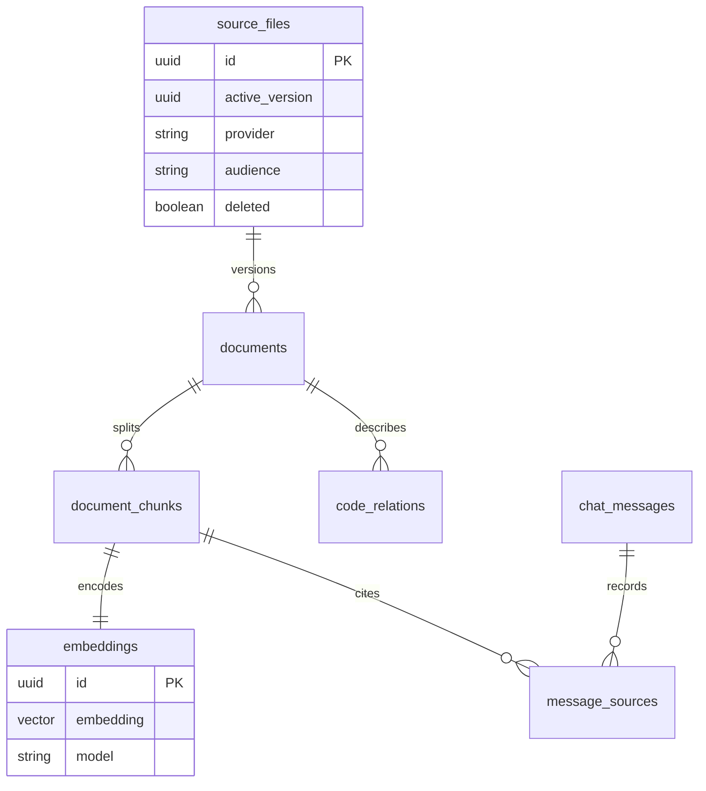
```mermaid
erDiagram
 source_files ||--o{ documents : versions
 source_files {
  uuid id PK
  uuid active_version
  string provider
  string audience
  boolean deleted
 }
 documents ||--o{ document_chunks : splits
 document_chunks ||--|| embeddings : encodes
 documents ||--o{ code_relations : describes
 document_chunks ||--o{ message_sources : cites
 chat_messages ||--o{ message_sources : records
 embeddings {
  uuid id PK
  vector embedding
  string model
 }

```

## 06-conversation-operations-erd

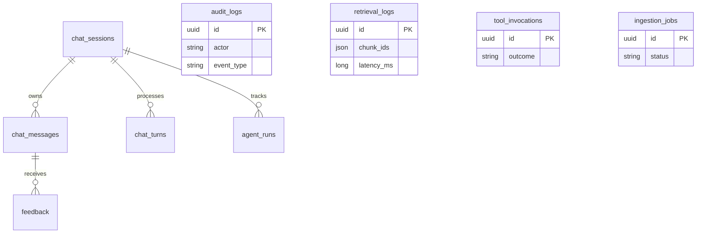
```mermaid
erDiagram
 chat_sessions ||--o{ chat_messages : owns
 chat_sessions ||--o{ chat_turns : processes
 chat_messages ||--o{ feedback : receives
 chat_sessions ||--o{ agent_runs : tracks
 audit_logs {
  uuid id PK
  string actor
  string event_type
 }
 retrieval_logs {
  uuid id PK
  json chunk_ids
  long latency_ms
 }
 tool_invocations {
  uuid id PK
  string outcome
 }
 ingestion_jobs {
  uuid id PK
  string status
 }

```

## 07-class-packages

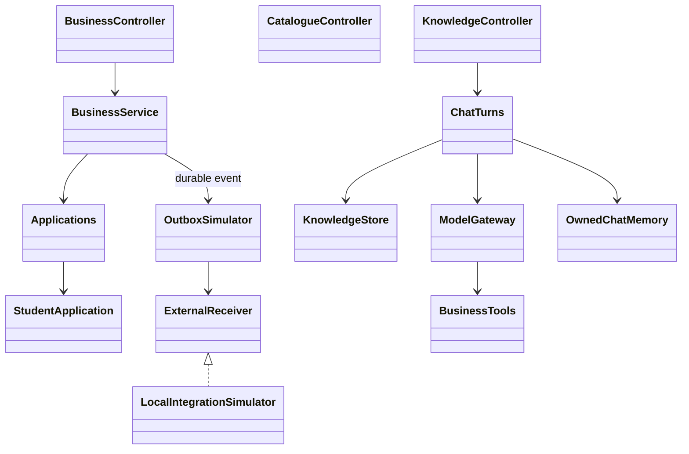
```mermaid
classDiagram
 class BusinessController
 class BusinessService
 class Applications
 class StudentApplication
 class CatalogueController
 class OutboxSimulator
 class ExternalReceiver
 class LocalIntegrationSimulator
 class KnowledgeController
 class ChatTurns
 class KnowledgeStore
 class ModelGateway
 class OwnedChatMemory
 class BusinessTools
 BusinessController --> BusinessService
 BusinessService --> Applications
 Applications --> StudentApplication
 BusinessService --> OutboxSimulator : durable event
 OutboxSimulator --> ExternalReceiver
 ExternalReceiver <|.. LocalIntegrationSimulator
 KnowledgeController --> ChatTurns
 ChatTurns --> KnowledgeStore
 ChatTurns --> ModelGateway
 ChatTurns --> OwnedChatMemory
 ModelGateway --> BusinessTools

```

## 08-application-state

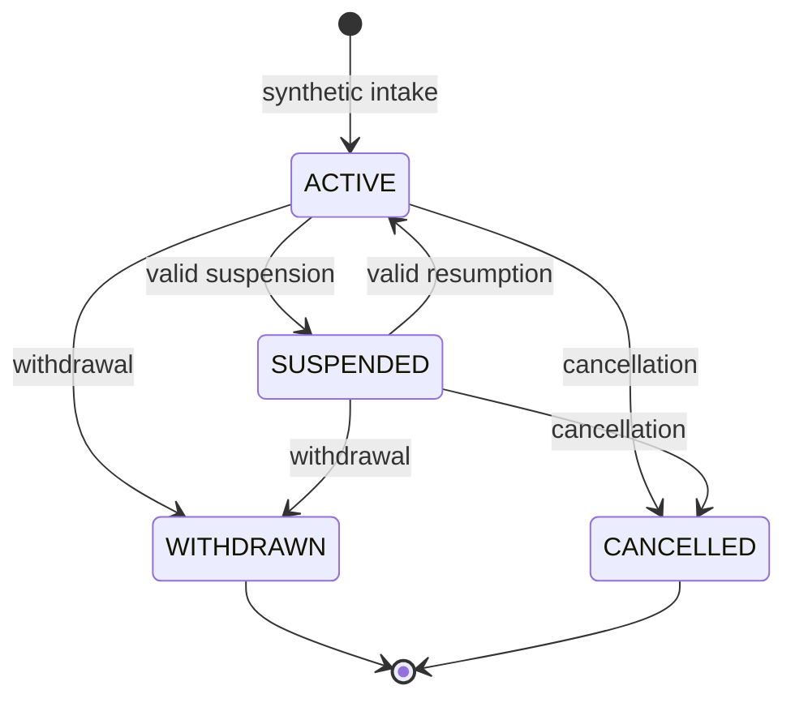
```mermaid
stateDiagram-v2
 [*] --> ACTIVE : synthetic intake
 ACTIVE --> SUSPENDED : valid suspension
 SUSPENDED --> ACTIVE : valid resumption
 ACTIVE --> WITHDRAWN : withdrawal
 SUSPENDED --> WITHDRAWN : withdrawal
 ACTIVE --> CANCELLED : cancellation
 SUSPENDED --> CANCELLED : cancellation
 WITHDRAWN --> [*]
 CANCELLED --> [*]

```

## 09-coc-state

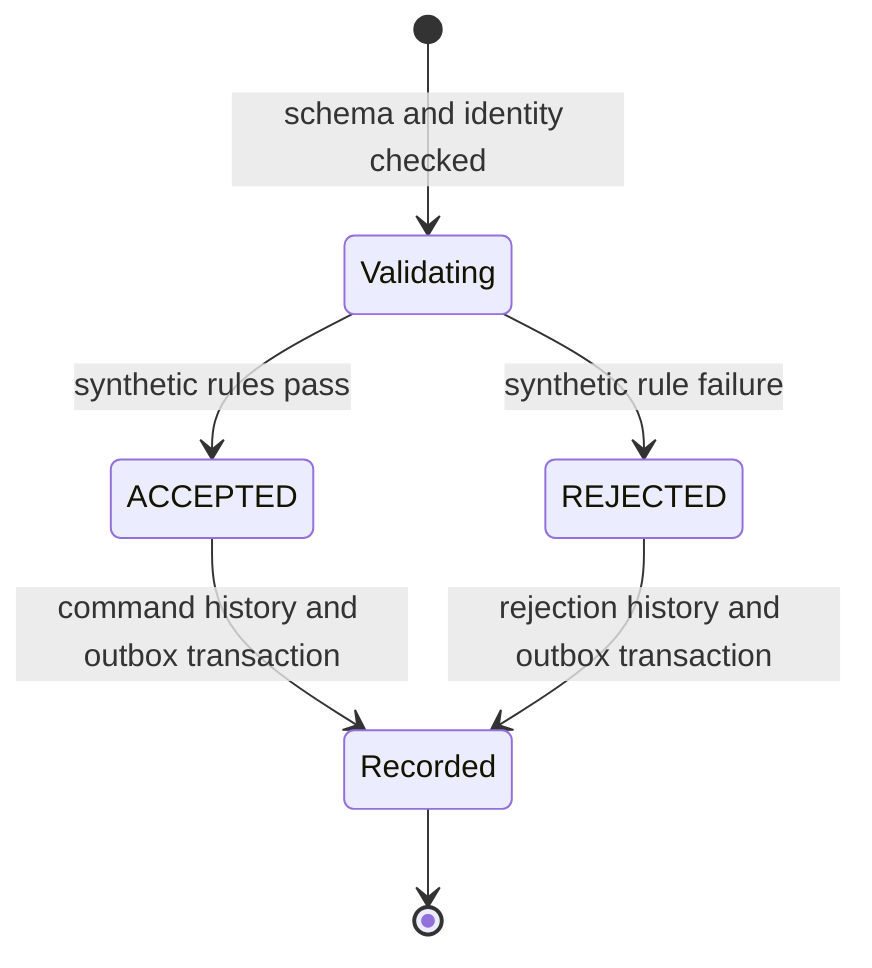
```mermaid
stateDiagram-v2
 [*] --> Validating : schema and identity checked
 Validating --> REJECTED : synthetic rule failure
 Validating --> ACCEPTED : synthetic rules pass
 ACCEPTED --> Recorded : command history and outbox transaction
 REJECTED --> Recorded : rejection history and outbox transaction
 Recorded --> [*]

```

## 10-import-state

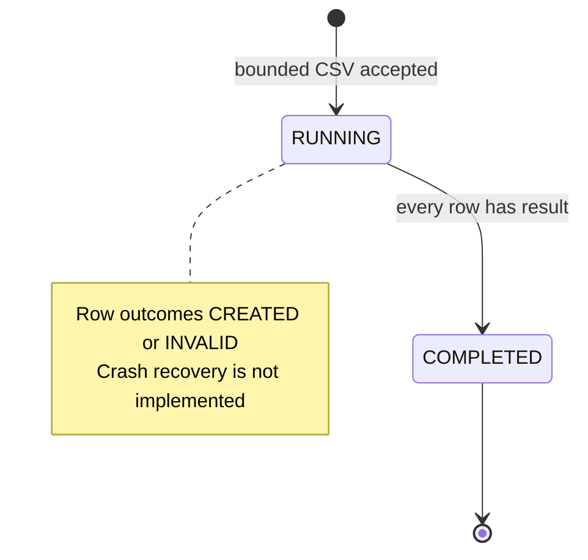
```mermaid
stateDiagram-v2
 [*] --> RUNNING : bounded CSV accepted
 RUNNING --> COMPLETED : every row has result
 COMPLETED --> [*]
 note right of RUNNING
   Row outcomes CREATED or INVALID
   Crash recovery is not implemented
 end note

```

## 11-ingestion-state

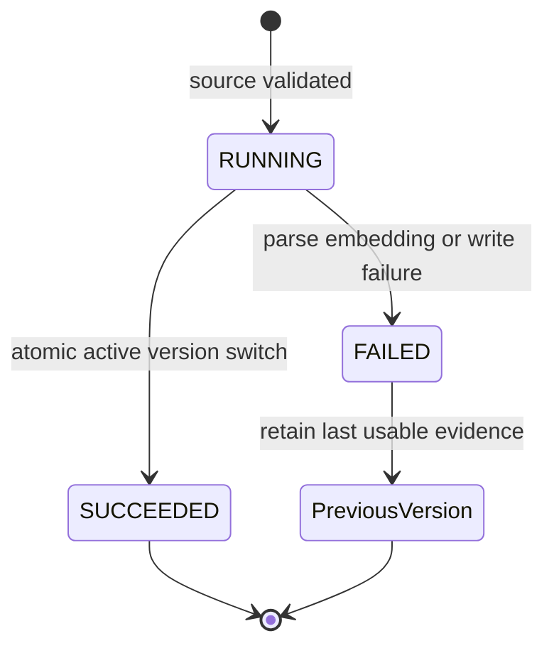
```mermaid
stateDiagram-v2
 [*] --> RUNNING : source validated
 RUNNING --> SUCCEEDED : atomic active version switch
 RUNNING --> FAILED : parse embedding or write failure
 FAILED --> PreviousVersion : retain last usable evidence
 SUCCEEDED --> [*]
 PreviousVersion --> [*]

```

## 12-local-deployment

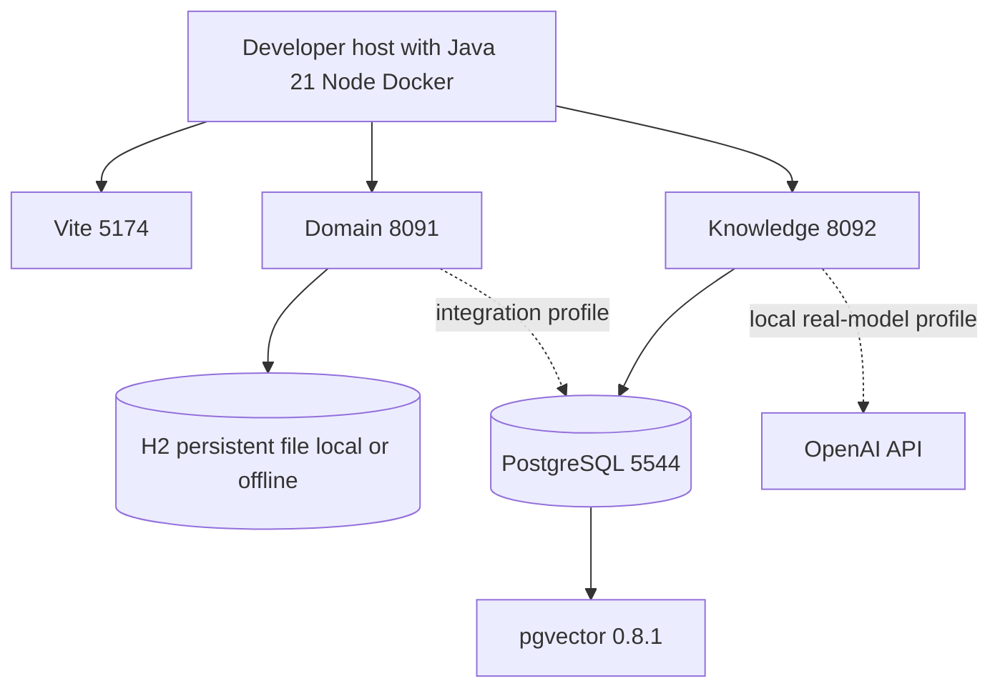
```mermaid
flowchart TB
 Host[Developer host with Java 21 Node Docker]
 Host --> Vite[Vite 5174]
 Host --> Domain[Domain 8091]
 Host --> Knowledge[Knowledge 8092]
 Domain --> H2[(H2 persistent file local or offline)]
 Domain -.->|integration profile| PG[(PostgreSQL 5544)]
 Knowledge --> PG
 PG --> Vector[pgvector 0.8.1]
 Knowledge -.->|local real-model profile| OpenAI[OpenAI API]

```

## 13-cloud-proposal

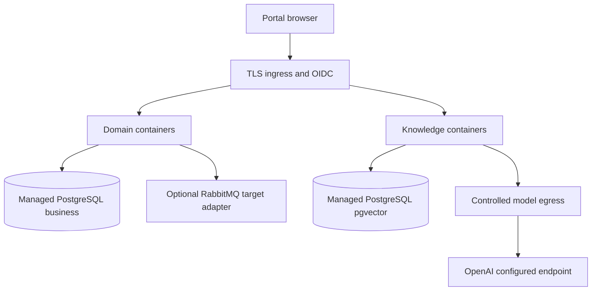
```mermaid
flowchart TB
 Browser[Portal browser] --> Edge[TLS ingress and OIDC]
 Edge --> Domain[Domain containers]
 Edge --> Knowledge[Knowledge containers]
 Domain --> DB[(Managed PostgreSQL business)]
 Knowledge --> KDB[(Managed PostgreSQL pgvector)]
 Knowledge --> Egress[Controlled model egress]
 Egress --> Model[OpenAI configured endpoint]
 Domain --> Broker[Optional RabbitMQ target adapter]

```

## 14-ingestion-data-flow

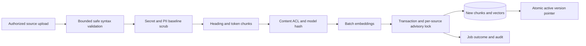
```mermaid
flowchart LR
 Upload[Authorized source upload] --> Parse[Bounded safe syntax validation]
 Parse --> Scrub[Secret and PII baseline scrub]
 Scrub --> Split[Heading and token chunks]
 Split --> Hash[Content ACL and model hash]
 Hash --> Emb[Batch embeddings]
 Emb --> TX[Transaction and per-source advisory lock]
 TX --> Chunks[(New chunks and vectors)]
 Chunks --> Active[Atomic active version pointer]
 TX --> Audit[Job outcome and audit]

```

## 15-query-data-flow

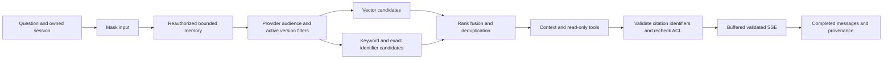
```mermaid
flowchart LR
 Question[Question and owned session] --> Mask[Mask input]
 Mask --> Memory[Reauthorized bounded memory]
 Memory --> ACL[Provider audience and active version filters]
 ACL --> Semantic[Vector candidates]
 ACL --> Keyword[Keyword and exact identifier candidates]
 Semantic --> RRF[Rank fusion and deduplication]
 Keyword --> RRF
 RRF --> Model[Context and read-only tools]
 Model --> Citations[Validate citation identifiers and recheck ACL]
 Citations --> Stream[Buffered validated SSE]
 Stream --> Persist[Completed messages and provenance]

```

## sequence-application-intake

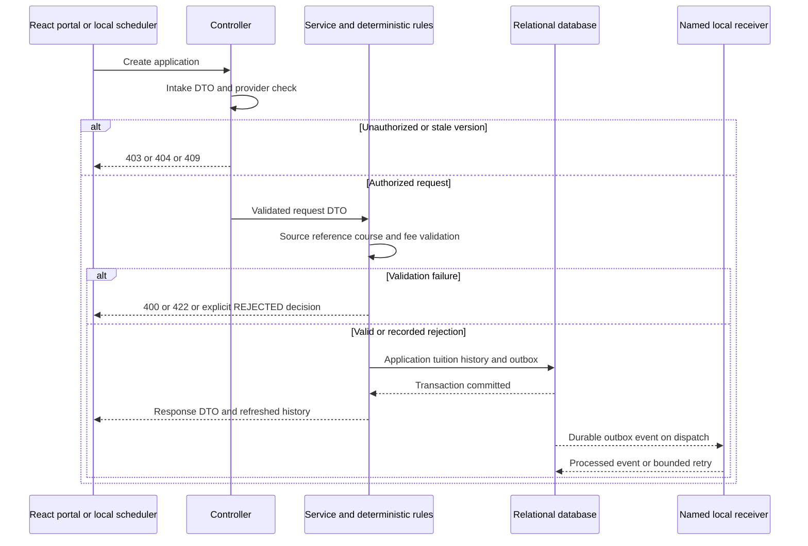
```mermaid
sequenceDiagram
 participant UI as React portal or local scheduler
 participant API as Controller
 participant Service as Service and deterministic rules
 participant DB as Relational database
 participant Sim as Named local receiver
 UI->>API: Create application
 API->>API: Intake DTO and provider check
 alt Unauthorized or stale version
  API-->>UI: 403 or 404 or 409
 else Authorized request
  API->>Service: Validated request DTO
  Service->>Service: Source reference course and fee validation
  alt Validation failure
   Service-->>UI: 400 or 422 or explicit REJECTED decision
  else Valid or recorded rejection
   Service->>DB: Application tuition history and outbox
   DB-->>Service: Transaction committed
   Service-->>UI: Response DTO and refreshed history
   DB-->>Sim: Durable outbox event on dispatch
   Sim-->>DB: Processed event or bounded retry
  end
 end

```

## sequence-attendance

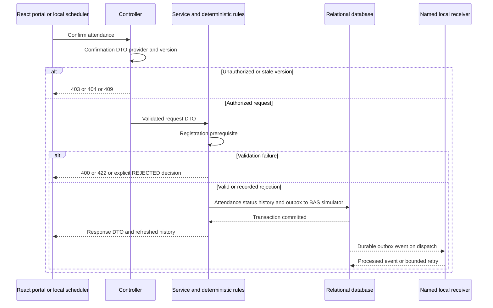
```mermaid
sequenceDiagram
 participant UI as React portal or local scheduler
 participant API as Controller
 participant Service as Service and deterministic rules
 participant DB as Relational database
 participant Sim as Named local receiver
 UI->>API: Confirm attendance
 API->>API: Confirmation DTO provider and version
 alt Unauthorized or stale version
  API-->>UI: 403 or 404 or 409
 else Authorized request
  API->>Service: Validated request DTO
  Service->>Service: Registration prerequisite
  alt Validation failure
   Service-->>UI: 400 or 422 or explicit REJECTED decision
  else Valid or recorded rejection
   Service->>DB: Attendance status history and outbox to BAS simulator
   DB-->>Service: Transaction committed
   Service-->>UI: Response DTO and refreshed history
   DB-->>Sim: Durable outbox event on dispatch
   Sim-->>DB: Processed event or bounded retry
  end
 end

```

## sequence-coc

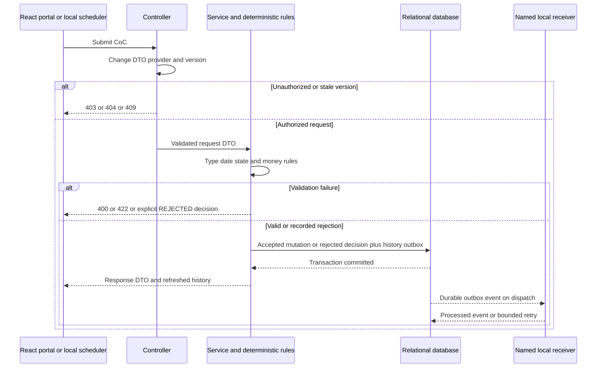
```mermaid
sequenceDiagram
 participant UI as React portal or local scheduler
 participant API as Controller
 participant Service as Service and deterministic rules
 participant DB as Relational database
 participant Sim as Named local receiver
 UI->>API: Submit CoC
 API->>API: Change DTO provider and version
 alt Unauthorized or stale version
  API-->>UI: 403 or 404 or 409
 else Authorized request
  API->>Service: Validated request DTO
  Service->>Service: Type date state and money rules
  alt Validation failure
   Service-->>UI: 400 or 422 or explicit REJECTED decision
  else Valid or recorded rejection
   Service->>DB: Accepted mutation or rejected decision plus history outbox
   DB-->>Service: Transaction committed
   Service-->>UI: Response DTO and refreshed history
   DB-->>Sim: Durable outbox event on dispatch
   Sim-->>DB: Processed event or bounded retry
  end
 end

```

## sequence-csv-import

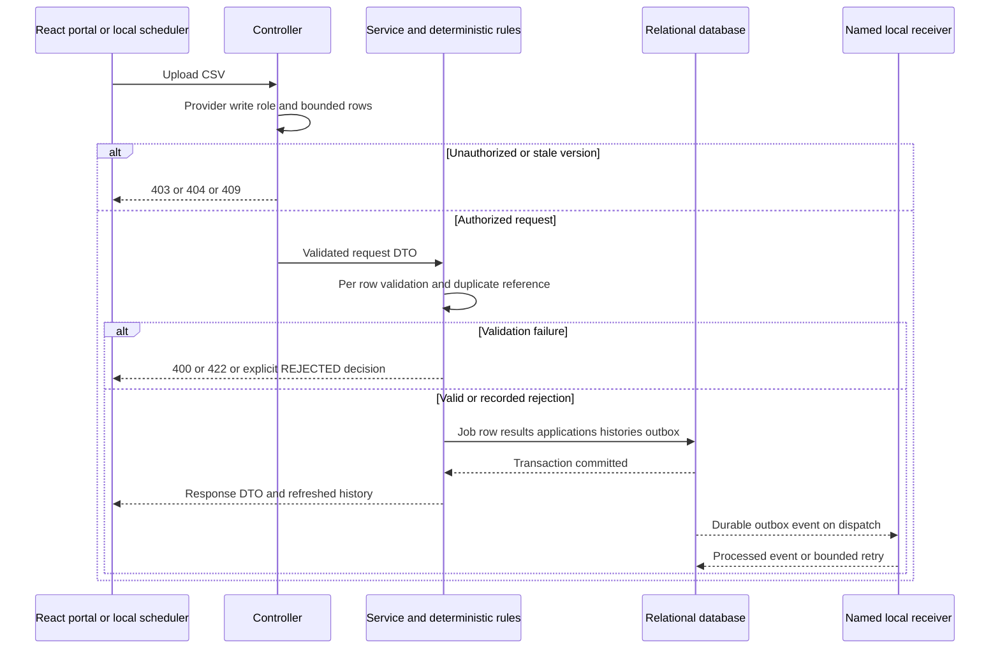
```mermaid
sequenceDiagram
 participant UI as React portal or local scheduler
 participant API as Controller
 participant Service as Service and deterministic rules
 participant DB as Relational database
 participant Sim as Named local receiver
 UI->>API: Upload CSV
 API->>API: Provider write role and bounded rows
 alt Unauthorized or stale version
  API-->>UI: 403 or 404 or 409
 else Authorized request
  API->>Service: Validated request DTO
  Service->>Service: Per row validation and duplicate reference
  alt Validation failure
   Service-->>UI: 400 or 422 or explicit REJECTED decision
  else Valid or recorded rejection
   Service->>DB: Job row results applications histories outbox
   DB-->>Service: Transaction committed
   Service-->>UI: Response DTO and refreshed history
   DB-->>Sim: Durable outbox event on dispatch
   Sim-->>DB: Processed event or bounded retry
  end
 end

```

## sequence-live-tool

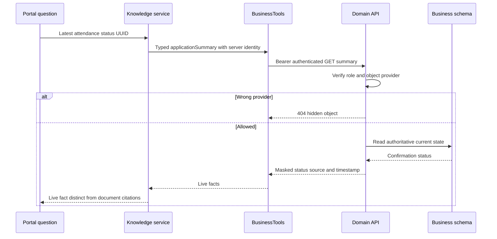
```mermaid
sequenceDiagram
 participant UI as Portal question
 participant K as Knowledge service
 participant Tool as BusinessTools
 participant B as Domain API
 participant DB as Business schema
 UI->>K: Latest attendance status UUID
 K->>Tool: Typed applicationSummary with server identity
 Tool->>B: Bearer authenticated GET summary
 B->>B: Verify role and object provider
 alt Wrong provider
  B-->>Tool: 404 hidden object
 else Allowed
  B->>DB: Read authoritative current state
  DB-->>B: Confirmation status
  B-->>Tool: Masked status source and timestamp
  Tool-->>K: Live facts
  K-->>UI: Live fact distinct from document citations
 end

```

## sequence-payment

```mermaid
sequenceDiagram
 participant UI as React portal or local scheduler
 participant API as Controller
 participant Service as Service and deterministic rules
 participant DB as Relational database
 participant Sim as Named local receiver
 UI->>API: Schedule payments
 API->>API: Object provider version and write role
 alt Unauthorized or stale version
  API-->>UI: 403 or 404 or 409
 else Authorized request
  API->>Service: Validated request DTO
  Service->>Service: Active registered application
  alt Validation failure
   Service-->>UI: 400 or 422 or explicit REJECTED decision
  else Valid or recorded rejection
   Service->>DB: Exact decimal instalments and history
   DB-->>Service: Transaction committed
   Service-->>UI: Response DTO and refreshed history
   DB-->>Sim: Durable outbox event on dispatch
   Sim-->>DB: Processed event or bounded retry
  end
 end

```

## sequence-publishing-retry

```mermaid
sequenceDiagram
 participant UI as React portal or local scheduler
 participant API as Controller
 participant Service as Service and deterministic rules
 participant DB as Relational database
 participant Sim as Named local receiver
 UI->>API: Scheduled outbox dispatch
 API->>API: Locked pending event rows
 alt Unauthorized or stale version
  API-->>UI: 403 or 404 or 409
 else Authorized request
  API->>Service: Validated request DTO
  Service->>Service: Receiver budget and idempotent processed event
  alt Validation failure
   Service-->>UI: 400 or 422 or explicit REJECTED decision
  else Valid or recorded rejection
   Service->>DB: Delivered or bounded backoff or DEAD
   DB-->>Service: Transaction committed
   Service-->>UI: Response DTO and refreshed history
   DB-->>Sim: Durable outbox event on dispatch
   Sim-->>DB: Processed event or bounded retry
  end
 end

```

## sequence-rag-chat

```mermaid
sequenceDiagram
 participant UI as React portal
 participant API as ChatTurns
 participant DB as Knowledge schema
 participant Model as Model adapter
 UI->>API: Authenticated POST streaming question
 API->>DB: Check session owner and claim active turn
 API->>DB: Retrieve active authorized vector and keyword candidates
 API->>Model: Masked question memory and untrusted evidence
 Model-->>API: Answer with citation IDs
 API->>DB: Recheck citation access
 API-->>UI: Validated buffered deltas
 API->>DB: Completed messages and citation provenance
 API-->>UI: Completion envelope
 alt Cancellation or failure
  API->>DB: CANCELLED FAILED or INTERRUPTED
  API-->>UI: Failure or partial state
 end

```

## sequence-registration

```mermaid
sequenceDiagram
 participant UI as React portal or local scheduler
 participant API as Controller
 participant Service as Service and deterministic rules
 participant DB as Relational database
 participant Sim as Named local receiver
 UI->>API: Confirm registration
 API->>API: Confirmation DTO provider and version
 alt Unauthorized or stale version
  API-->>UI: 403 or 404 or 409
 else Authorized request
  API->>Service: Validated request DTO
  Service->>Service: Active application and confirmation state
  alt Validation failure
   Service-->>UI: 400 or 422 or explicit REJECTED decision
  else Valid or recorded rejection
   Service->>DB: Registration status history and outbox to CEM simulator
   DB-->>Service: Transaction committed
   Service-->>UI: Response DTO and refreshed history
   DB-->>Sim: Durable outbox event on dispatch
   Sim-->>DB: Processed event or bounded retry
  end
 end

```

